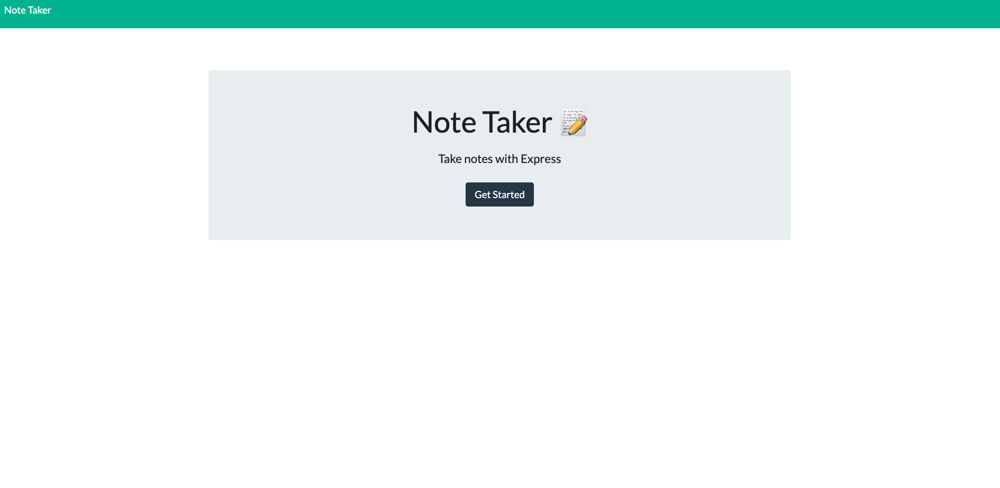

# Note Taker

## Description

This project help to manager your daily notes, have an easy interface to manage your notes.

[Click here to visit the live URL deployed on Heroku](https://stark-sea-96040.herokuapp.com/)

## Table of Contents

- [Usage](#usage)
- [Credits](#credits)
- [Questions](#questions)
- [License](#license)

## Usage

Visit the app url https://stark-sea-96040.herokuapp.com/

## Contributing

You can participate in this project, submiting bugs, and feature request. Also you can help testing this project using jest. Also we want app authentication and authorization to this project.

## Questions

for any questions feel free to contact me to joseduardo15062005@gmail.com

checkout the [GitHub profile](https://github.com/joseduardo15062005)

## License

Code released under the MIT License [License](https://choosealicense.com/licenses/mit/).
for additional questions please feel free to contact us via email at joseduardo15062005@gmail.com
